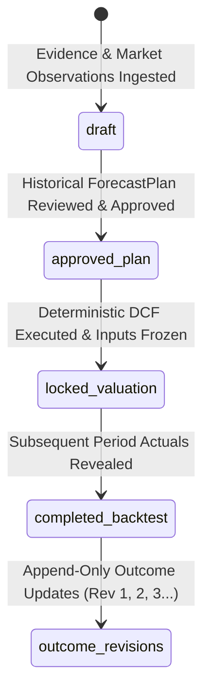

# Historical Backtest Runbook & Retailer Reference Guide

This runbook defines the canonical lifecycle states, extraction semantic rules, and backtest workflow for historical retailer backtesting across the JSE stock analysis system.

---

## 1. Historical Backtest Lifecycle

The historical backtesting pipeline maintains strict separation between the backtest container, the analyst forecast plan, the immutable valuation result, and append-only reveal outcomes.



### Exact Persisted Lifecycle Fields

| Entity / Table | Persisted Status Field | Supported Values | Semantic Meaning |
| :--- | :--- | :--- | :--- |
| **`historical_backtests`** | `status` (`text`) | `draft`<br>`locked`<br>`completed`<br>`failed` | **Container lifecycle status**.<br>• `draft`: Evidence snapshot, market observations, and assumptions may still change.<br>• `locked`: Input hash frozen, assumptions locked, valuation executed.<br>• `completed`: Next-period actuals revealed and outcome analysis persisted.<br>• `failed`: Pipeline or gating failure. |
| **`historical_backtest_plans`** | `status` (`text`) | `draft`<br>`proposed`<br>`approved`<br>`rejected`<br>`superseded` | **ForecastPlan approval status**.<br>• `draft` / `proposed`: Assumptions under review.<br>• `approved`: Analyst has explicitly approved all accepted assumptions and the plan hash is frozen. |
| **`historical_backtest_results`** | *Insert-Only Record* | `historical_result_id` (UUID), `input_hash` (SHA256) | **Historical valuation result immutability**.<br>Results are immutable, write-once records permanently anchored to the backtest `input_hash`. They have no update endpoint and cannot be recalculated or altered once persisted. |
| **`historical_backtest_outcomes`** | `outcome_status` (`text`) | `partial`<br>`completed`<br>`completed_superseded` | **Append-only outcome revisions**.<br>• `partial`: Initial reveal with subset of actuals.<br>• `completed`: Full reveal and outcome comparison complete.<br>• `completed_superseded`: Replaced by a higher-precision revision via `supersedes_outcome_id`. |

### Key Lifecycle Principles
1. **Backtest Lifecycle vs. Valuation Immutability**:
   - When outcome analysis completes, `historical_backtests.status` transitions from `locked` to `completed`.
   - The historical valuation result (`historical_backtest_results`) remains **locked and immutable** indefinitely. The completed backtest status never unlocks or modifies the valuation result.
2. **Append-Only Outcome Revisions**:
   - Outcome evaluations are append-only (`revision` integer: 1, 2, 3...).
   - A newer completed outcome supersedes an older outcome (via `supersedes_outcome_id`), preserving full audit history.
   - The locked historical valuation (fair value, EV, equity value, input hash) is never rewritten.

---

## 2. Reference Retailer Backtest: TRU (Truworths International)

The FY2025 → FY2026 backtest for Truworths International (`TRU.JO`) serves as the canonical reference implementation for South African retail equity analysis.

### Reference Snapshot Metadata
- **Ticker**: `TRU.JO`
- **Historical as-of date**: `2025-08-31`
- **Historical baseline period**: `FY2025` (period end: `2025-06-29`)
- **Outcome comparison period**: `FY2026` (period end: `2026-06-28`)
- **Historical Backtest ID**: `4230b66f-6be8-480a-878d-77d69eaeacd8`
- **Backtest Lifecycle Status**: `completed`
- **Historical Plan ID**: `ba6d3186-8a51-44a3-8f67-3ad34ece3da6` (Status: `approved`)
- **Historical Result ID**: `6768e249-36c9-4f4d-afff-e3bd832e5f6a` (Result Immutability: `locked / immutable`)
- **Locked Historical Fair Value**: `R72.8232 / share`
- **Locked Enterprise Value (EV)**: `R30,356,971,061.15`
- **Locked Equity Value**: `R27,334,971,061.15`
- **Frozen Input Hash**: `ccf6a05b91b47ec458186ad1e73f9a78496d64f34c96f2e99dfbba7c8872f959`
- **Authoritative Reveal Outcome**: **Revision 3** (Status: `completed`, comparable cash capex basis)

> [!IMPORTANT]
> **No Special-Casing**: The reference designation is documentation and regression-verification metadata only. No code path in the production valuation or forecasting engine may include `if ticker == "TRU.JO"` or retailer-specific hard-coded valuation branches.

---

## 3. Retailer Historical Extraction – Required Semantic Distinctions

Extracting financial data from retail financial statements (SENS and AFS) requires precise semantic distinctions. The following rules are generic across all retail companies:

1. **Accounting Revenue $\neq$ Sale of Merchandise**:
   - *Accounting Revenue* includes ancillary revenue streams such as interest on customer credit accounts, financial services charges, delivery fees, and commissions.
   - *Sale of Merchandise* represents turnover from retail goods sold. Models anchoring sales growth on merchandise turnover must not conflate the two.
2. **Retail Sales May Differ From Both**:
   - *Retail sales* disclosed in trading updates or SENS frequently includes VAT or franchise partner retail sales prior to statutory intercompany eliminations.
3. **Trading Profit $\neq$ PBIT / Operating Profit**:
   - In South African retail reporting, *Trading Profit* reflects retail operating earnings before finance income, other income, or capital items. Operating profit often includes non-trading interest or sundry income.
4. **Trading Margin Denominator Must Be Explicit**:
   - Trading margin is defined as $\text{Trading Profit} / \text{Sale of Merchandise}$, not total accounting revenue. The extraction layer must explicitly type and verify both components.
5. **Income-Statement D&A May Differ from Cash-Flow D&A Addback**:
   - Income statement operating expenses often report depreciation net of distribution costs reallocated to Cost of Sales.
   - The Statement of Cash Flows reconciliation (e.g. Note 33.1) adds back the full non-cash depreciation and amortisation across both operating expenses and Cost of Sales.
   - The full non-cash addback must be preserved for Free Cash Flow to Firm (FCFF).
6. **Cash Capex $\neq$ Accounting Additions**:
   - *Cash Capex* from the Statement of Cash Flows represents actual cash paid for property, plant, equipment, and software additions.
   - *Accounting Additions* include non-cash capital accruals, capital creditors, and IFRS 16 lease additions. Historical and forward valuation comparisons must maintain a consistent cash capex basis.
7. **Working-Capital Sign Convention Must Be Explicit**:
   - Changes in working capital must explicitly distinguish between *cash flow* (positive = cash generated/inflow) and *investment* (positive = cash consumed/outflow).
   - In DCF formulas where $\text{FCFF} = \text{NOPAT} + \text{D\&A} - \text{Capex} - \Delta\text{WC}$, $\Delta\text{WC}$ represents cash investment. A cash inflow of $+R166\text{m}$ represents an investment of $-R166\text{m}$, contributing $+R166\text{m}$ to FCFF.
8. **Reported Net Cash May Require Exclusions**:
   - Headline reported net cash often excludes restricted cash (e.g., charitable trusts or share scheme trust balances) and includes liquid short-term investments (money market funds) while deducting current borrowings and bank overdrafts. The equity bridge must reconcile to the exact reported headline figure.
9. **Lease Liabilities Remain Separate from Financial Net Cash**:
   - Under IFRS 16, lease liabilities are substantial for retailers. They must be maintained as a distinct `lease_debt_adjustment` in the enterprise-to-equity bridge, never netted silently into liquid operational cash.
10. **Weighted-Average EPS Shares $\neq$ Point-in-Time Valuation Denominator**:
    - Weighted Average Number of Shares (WANOS) basic and diluted are period-weighted for accounting EPS/HEPS.
    - DCF fair value per share requires point-in-time external shares (issued shares minus treasury shares).
11. **Treasury Shares Must Be Treated Explicitly**:
    - Treasury shares held by subsidiaries or share trusts must be extracted and explicitly subtracted from issued shares to prevent share-count inflation.
12. **Announcement-Date Shares vs. Period-End Shares**:
    - When the backtest valuation date is set after the results publication date, announcement-date external share counts reflect subsequent treasury movements and are more current than period-end counts. Backtests must record an explicit denominator policy note.
13. **AFS Exact Values Take Precedence over Rounded SENS**:
    - SENS headline announcements often round figures to billions or millions (e.g., R21.3bn). Audited AFS reports exact precision (e.g., R21,323,000,000). AFS observations supersede rounded SENS where period and accounting definition match.

---

## 4. Retailer Historical Backtest Workflow

Every historical retailer backtest follows this strict 15-step sequence:

1. **Validate Historical Manifest**: Verify `manifest.json` schema, period-end dates, and source availability dates (`published_at > period_end`).
2. **Extract SENS and AFS**: Parse structured tables and narrative notes from company disclosure PDFs and SENS text files.
3. **Preserve Raw Evidence & Provenance**: Store verbatim text quotes, page numbers, note references, and document hashes.
4. **Parse Typed Metrics**: Emit strongly-typed financial metrics (`FinancialMetric`) with explicit scale and unit normalization.
5. **Reconcile Semantic Duplicates & Conflicts**: Match cross-document observations by identity date and segment, flagging any genuine disclosure discrepancies.
6. **Apply AFS Precedence**: Automatically elevate exact AFS observations over rounded SENS headline observations.
7. **Run Historical Readiness Gate**: Evaluate whether all required retail baseline concepts (sales, margin, D&A, capex, working capital, tax, net cash, leases, shares) meet semantic validation constraints.
8. **Create HistoricalForecastPlan**: Generate a versioned draft plan linked exclusively to cutoff evidence.
9. **Approve Assumptions**: Analyst accepts assumptions with explicit rationale and source documentation IDs.
10. **Lock Deterministic Valuation**: Execute deterministic DCF valuation, persist immutable result record, and freeze the 64-character SHA256 input hash (`BacktestStatus.LOCKED`).
11. **Reveal Next-Period Actuals**: Ingest the subsequent period's published results after the valuation has been locked.
12. **Compare Forecast vs. Actual**: Calculate absolute and percentage errors across operational and financial metrics.
13. **Calculate Valuation Performance Separately**: Compare frozen forecast fair value against post-announcement market prices and calculate perfect-foresight diagnostics.
14. **Persist Append-Only Outcomes**: Store outcomes as versioned revisions (`revision 1, 2, 3...`) in `historical_backtest_outcomes`.
15. **Record Proposed Learning Only**: Synthesize forward methodology learnings for analyst review without mutating locked history.

---

## 5. Developer & Test Verification

A dedicated verification helper is provided in [`gui/modules/analysis/historical_reference.py`](file:///c:/Users/Dion/Desktop/Projects/stock_analysis/gui/modules/analysis/historical_reference.py):

```python
from modules.analysis.historical_reference import verify_tru_reference_backtest

# Run regression check against production PostgreSQL database
result = verify_tru_reference_backtest()
assert result.is_valid is True
assert result.fair_value == Decimal("72.8232")
assert result.enterprise_value == Decimal("30356971061.15")
assert result.equity_value == Decimal("27334971061.15")
assert result.input_hash == "ccf6a05b91b47ec458186ad1e73f9a78496d64f34c96f2e99dfbba7c8872f959"
assert result.authoritative_outcome_revision == 3
```
